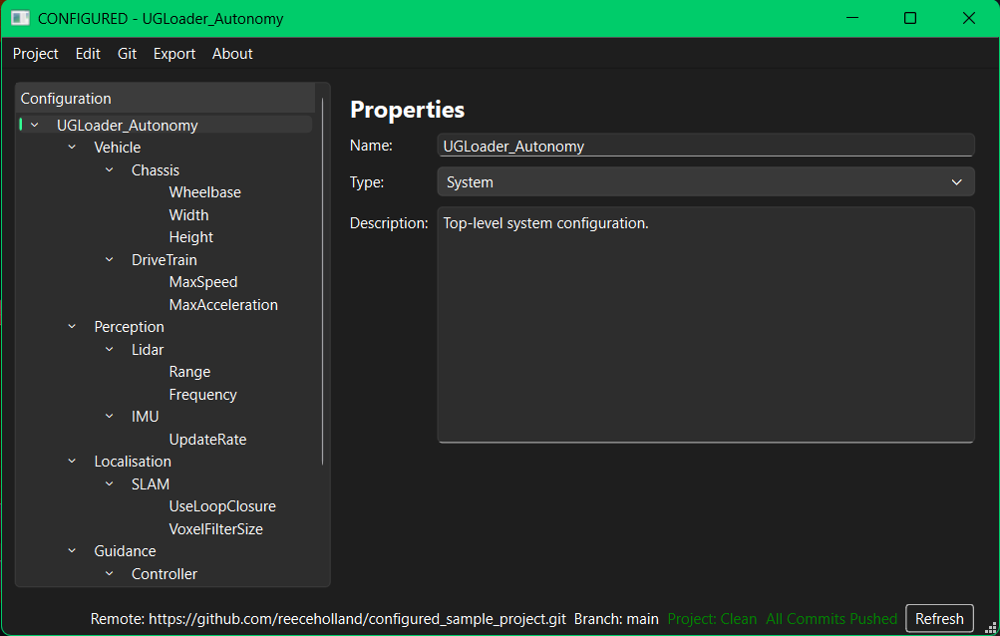

# CONFIGURED

**Robotics Configuration Studio**

CONFIGURED is a C++17 and Qt 6 desktop application for creating, editing,
validating, exporting, and Git-managing structured robotics configuration
projects.

The application is built for robotics and autonomous systems projects where
configuration data needs to be readable, versioned, and exported without
manually editing JSON, XML, or ad hoc parameter files.

---

## Screenshots

### Home Screen

The home screen provides entry points for creating a project, opening an
existing `.configured` file, cloning a remote project, and opening help.


### Project Metadata

New and existing projects use a metadata dialog for project identity, version,
platform, Git-managed state, last modified timestamp, and commit metadata.


### Project Editor

The editor shows the configuration hierarchy on the left and editable item
properties on the right.



### Parameter Editing

Parameter nodes expose key, value, unit, and required fields. Validation is
shown inline while editing.


---

## Current Status

CONFIGURED is under active development. The current application version in
`CMakeLists.txt` is `0.5.0`.

Current focus areas include:

- structured project editing
- project save/load workflows
- inline and whole-project validation
- Git-backed project workflows
- remote clone, pull, push, and branch workflows
- JSON and XML parameter export
- maintainable C++/Qt architecture

---

## Functionality

### Project Model

CONFIGURED models a project as a hierarchy:

```text
System
  Subsystem
    Component
      Parameter
```

Each configuration item stores:

- name
- type
- description
- child items
- dirty/error visual state

Parameter items also store:

- parameter key
- parameter value
- unit
- required flag

New projects are initialized with a sample robotics configuration tree so the
editor opens with a useful starting structure.

### Home Workflow

From the home screen users can:

- create a new project
- open an existing `.configured` project file
- connect to a remote Git repository by cloning it locally
- open the built-in help screen

Remote clone runs on a worker thread and, after cloning, CONFIGURED searches the
repository root for a single `.configured` file to open.

### Project Metadata

Project metadata includes:

- project name
- description
- author
- company
- version
- robot platform
- Git-managed flag
- last modified timestamp
- Git commit hash

Metadata can be edited from the Project menu. Enabling Git management for a
project initializes a Git repository in the project folder when needed.

### Editor

The editor provides:

- a tree view of the configuration hierarchy
- a properties panel for the selected item
- item type selection for System, Subsystem, Component, and Parameter
- child creation based on the selected item's role
- selected item removal
- dirty state tracking for unsaved edits
- inline field validation and visual error highlighting

Default child creation follows the model hierarchy:

```text
System -> Subsystem
Subsystem -> Component
Component -> Parameter
Parameter -> Parameter
```

### Persistence

Projects are saved as `.configured` files. A Git-managed project typically looks
like:

```text
MyProject/
  MyProject.configured
  .git/
```

The `.configured` file stores metadata and the configuration tree as structured
JSON.

### Validation

Validation happens both while editing and before saving.

Current validation covers:

- required project name
- invalid item names
- duplicate parameter keys
- missing required parameter keys
- missing required parameter values
- whole-project validation before save

Invalid fields are highlighted in the editor or metadata dialog. Tree items also
show error state when a selected item fails validation.

### Export

Project parameters can be exported to:

- JSON
- XML

Exports include project metadata and the collected parameter list. For
Git-managed projects, exports include the current commit hash when available.
For non-Git-managed projects, exports include the project version.

### Git Integration

Git support is available for Git-managed projects.

Supported workflows include:

- initialize a repository for a new Git-managed project
- configure Git identity locally or globally
- create an initial commit during new-project onboarding
- connect or update an `origin` remote
- clone a remote project from the home screen
- show Git status
- save-and-commit or commit without saving
- switch local branches
- switch to remote-only branches
- pull remote changes with a preflight dialog
- push changes, including first push when no upstream exists
- refresh visible Git status

The editor status bar shows:

- remote URL
- current branch
- clean or dirty working tree state
- first-push or unpushed-commit state

Clone, pull, and push use worker objects so long-running Git operations do not
block the Qt UI.

---

## Architecture

CONFIGURED uses a layered structure with clear ownership boundaries.

```text
MainWindow
  owns the active project session
  owns the current project file path
  coordinates screen switching and user workflows

EditorScreenWidget
  displays and edits the active project
  borrows the project pointer
  does not save or load projects

ProjectService
  creates, loads, saves, validates, and updates project metadata

ConfiguredProject
  owns project metadata and the root configuration item
  serializes and deserializes project files

ConfiguredItem
  represents one node in the configuration hierarchy

GitWorkflowController
  coordinates user-facing Git workflows

GitService
  wraps low-level Git commands

StatusBarController
  refreshes Git status labels in the editor status bar

CloneWorker / GitPullWorker / GitPushWorker
  run long Git operations outside the GUI thread
```

---

## Core Components

| Component | Responsibility |
| --- | --- |
| `MainWindow` | Main application controller, screen switching, project session ownership |
| `HomeScreenWidget` | Entry screen for creating, opening, cloning, and help |
| `EditorScreenWidget` | Tree editor, property editing, dirty state, inline validation |
| `ProjectMetadataDialog` | Project metadata editing and validation |
| `ConfiguredProject` | Project model, metadata, parameter collection, JSON persistence |
| `ConfiguredItem` | Hierarchical configuration item model |
| `ProjectService` | Project create/load/save/update workflows |
| `ProjectValidator` | Whole-project validation before save |
| `ItemValidator` | Per-item and parameter validation |
| `ProjectMetadataValidator` | Project metadata validation |
| `GitWorkflowController` | Commit, branch, pull, push, remote, and onboarding workflows |
| `StatusBarController` | Git status bar visibility and status refresh |
| `GitService` | Low-level Git command wrapper |
| `CloneWorker` | Asynchronous remote clone worker |
| `GitPullWorker` | Asynchronous pull worker |
| `GitPushWorker` | Asynchronous push worker |
| `JsonProjectExporter` | JSON parameter export |
| `XmlProjectExporter` | XML parameter export |

---

## Project Structure

```text
configured/
  include/
    app/
    core/
      git/
      validation/
    export/
    ui/
  src/
    app/
    core/
      git/
      validation/
    export/
    ui/
  tests/
  resources/
    help/
    images/
  docs/
    screenshots/
  installer/
  CMakeLists.txt
  CMakePresets.json
  README.md
```

---

## Requirements

- C++17 compiler
- CMake 3.21 or newer
- Ninja
- Qt 6 with:
  - Core
  - Gui
  - Widgets
- Git
- Doxygen, optional, for documentation generation

On Windows, the current presets expect Qt at:

```text
C:/Qt/6.10.1/msvc2022_64
```

On Ubuntu/Debian, install the build dependencies with:

```bash
sudo apt-get update
sudo apt-get install -y build-essential cmake git ninja-build qt6-base-dev
```

---

## Configure And Build

From the repository root:

```powershell
cmake --preset x64-debug
cmake --build out/build/x64-debug
```

Release build:

```powershell
cmake --preset x64-release
cmake --build out/build/x64-release
```

Linux debug build:

```bash
cmake --preset linux-debug
cmake --build out/build/linux-debug
```

Linux release build:

```bash
cmake --preset linux-release
cmake --build out/build/linux-release
```

---

## Run

Debug build:

```powershell
out/build/x64-debug/Configured.exe
```

Release build:

```powershell
out/build/x64-release/Configured.exe
```

Linux debug build:

```bash
out/build/linux-debug/Configured
```

Linux release build:

```bash
out/build/linux-release/Configured
```

---

## Run Tests

Build first:

```powershell
cmake --build out/build/x64-debug
```

Run all tests:

```powershell
ctest --test-dir out/build/x64-debug --output-on-failure
```

Run a specific test:

```powershell
ctest --test-dir out/build/x64-debug --output-on-failure -R ProjectServiceTest
```

Current test areas include:

- configured item behavior
- project save/load round trips
- project service create/load/save workflows
- project-wide validation
- item and metadata validation
- Git service behavior
- Git workflow controller behavior
- status bar controller behavior

The first configure may download GoogleTest through CMake `FetchContent`.

---

## Generate Documentation

If Doxygen is installed:

```powershell
cmake --build out/build/x64-debug --target doc
```

Generated documentation is written under the build directory:

```text
out/build/x64-debug/docs
```

---

## Configuration File Example

```json
{
  "projectName": "My Rover",
  "description": "Example robotics configuration",
  "author": "Reece Holland",
  "company": "Example Co",
  "version": "0.5.0",
  "lastModified": "2026-04-21T10:15:00",
  "robotPlatform": "Rugged Rover",
  "gitManaged": true,
  "gitCommitHash": "abc1234",
  "root": {
    "name": "System",
    "type": "System",
    "description": "Top-level system configuration.",
    "children": [
      {
        "name": "Drivetrain",
        "type": "Subsystem",
        "description": "",
        "children": [
          {
            "name": "LeftMotor",
            "type": "Component",
            "description": "",
            "children": [
              {
                "name": "MaxRPM",
                "type": "Parameter",
                "description": "",
                "parameterKey": "max_rpm",
                "parameterValue": "150",
                "parameterUnit": "rpm",
                "required": true,
                "children": []
              }
            ]
          }
        ]
      }
    ]
  }
}
```

---

## Development Notes

### Ownership Model

`MainWindow` owns the active project:

```cpp
std::unique_ptr<ConfiguredProject> currentProject_;
QString currentProjectFilePath_;
```

`EditorScreenWidget` receives a non-owning pointer:

```cpp
editor_->setProject(currentProject_.get());
```

This keeps persistence and session ownership out of the editor widget.

### Save Workflow

The save path is:

```text
MainWindow
  ProjectService::saveProject
    ProjectValidator::validate
    ConfiguredProject::saveToFile
```

### Git Workflow Boundary

User-facing Git orchestration lives in `GitWorkflowController`, while
`GitService` remains a lower-level command wrapper. Long-running Git operations
should use worker objects and `QThread`.

Current worker-backed operations:

- clone
- pull
- push

---

## Installer

The `installer/` directory contains WiX project files and PowerShell scripts for
building Windows installer artifacts:

- `build_msi.ps1`
- `build_bundle.ps1`
- `Package.wxs`
- `Bundle.wxs`
- `Configured.Setup.wixproj`
- `Configured.Bundle.wixproj`

---

## Roadmap

Planned or likely future work:

- Save As workflow
- clearer merge conflict handling
- richer branch/upstream status display
- improved remote URL management
- stronger typed parameter values
- undo/redo
- ROS 2 YAML export
- richer validation summaries
- plugin-based configuration extensions

---

## Contributing

Contributions, ideas, and feedback are welcome.

Recommended development loop:

```powershell
cmake --build out/build/x64-debug
ctest --test-dir out/build/x64-debug --output-on-failure
```

Please keep changes focused and add tests for project service, validation,
persistence, export, or Git workflow behavior where practical.

---

## License

MIT License. See `LICENSE`.

---

## Author

Reece Holland  
Software Engineer - Robotics and Autonomous Systems
