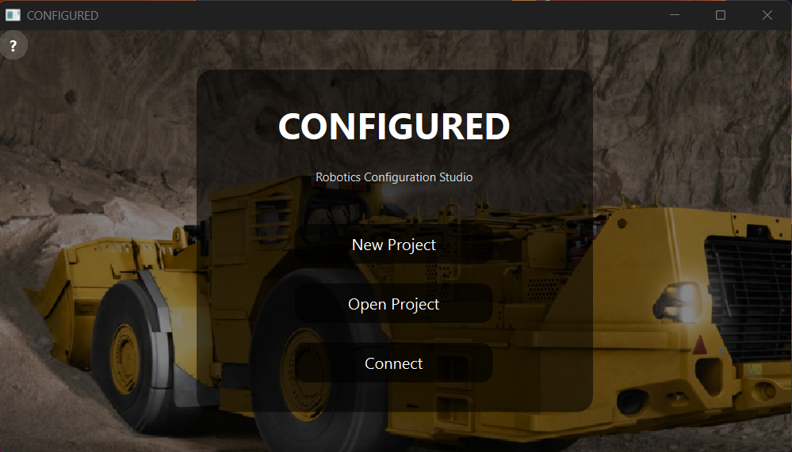
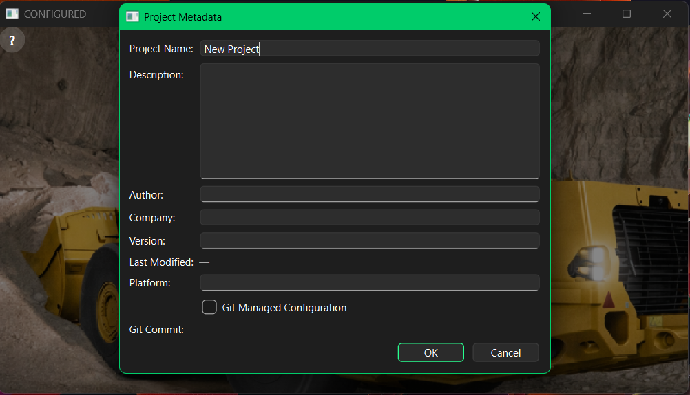
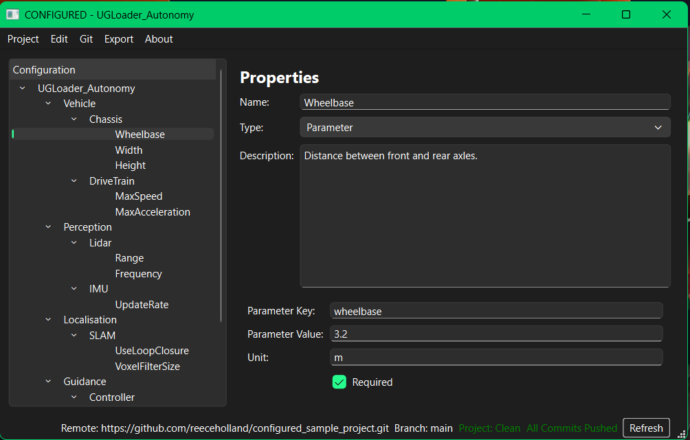

User Guide
==========

Home Screen
-----------

The home screen provides entry points for project work and help.

Creating Or Opening Projects
----------------------------

From the home screen, you can create a new project, open an existing
``.configured`` file, clone a remote Git repository, or open the help screen.

New projects collect metadata such as project name, version, platform, author,
company, Git-managed state, and project location.

Editing Configuration
---------------------

The editor stores configuration as a hierarchy:

.. code-block:: text

   System
     Subsystem
       Component
         Parameter

Parameters include a key, value, unit, and required flag. The editor validates
fields while you work and highlights invalid entries.

Validation
----------

The application validates:

* required project names
* filesystem-safe project names
* valid item names
* required parameter keys and values
* duplicate parameter keys

Saving And Exporting
--------------------

Projects are saved as ``.configured`` files. Parameters can be exported to JSON
or XML from the export menu.

Git Workflows
-------------

Git-managed projects support status, identity configuration, commit, branch
switching, pull, push, and remote connection workflows. Remote clone runs in the
background so the application stays responsive while repositories are fetched.
